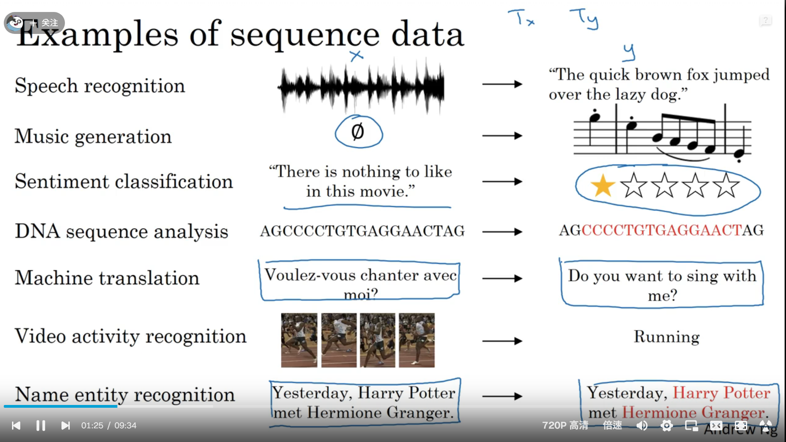

# Deep Learning --- Andrew Ng  

## Natural Language Processing Section

### Why not a standard network?

1. Inputs,outputs can be different lengths in different examples.

2. Doesn't share features learned across different positions of text.(seem like the convolution neural network) 

which means the parameter will be so great that we couldn't afford it's trainning. 

### Recurrent Neural Network

1. it can use the previous inputs in a sentences to predict the current word's output.(but it can't use the after word, which makes it weak in some task for example in masked task)

2. it can't remember the remote information provided by the much earlier text.

3. it can't parallel training.

4. $$ h_t = tanh(x_t*W^T_{ih} + b_{ih} + h_{t-1}*W^T_{hh}+b_{hh})  $$

5.  ```python
        def forward(x,h_0 = None):
            if batch_first:
                x = x.transpose(0,1)
            seq_len, batch_size,_ = x.size()
            if h_0 is None:
                h_0 = torch.zero(num_layers,batch_size,hidden_size)
            h_t_minus_1 = h_0
            h_t = h_0
            output = []
            for t in range(seq_len):
                for layer in range(num_layers):
                    h_t[layer]= torch.tanh(
                        x[t] @ weight_ih[layer].T
                        + bias_ih[layer]
                        + h_t_minus_1[layer] @ weight_hh[layer].T
                        + bias_hh[layer]
                    )
                output.append(h_t[-1])
                h_t_mins_1 = h_t
            output = torch.stack(output)
            if batch_first:
                output = output.transpose(0,1)
            return output, h_t
    ```

6.   

7. The RNN Architecture continuoues update the weight using for match current input x_t and the weight using for remember previous content h_t-1.

### Practice

if i want to practice my ability to build an RNN to solve a real-world problem. what should i do?

here are the guide for your demand.

1. Find a NLP dataset.
answer: use PTB dataset(the classic dataset in NLP field.)  
interesting discovery in the PTB dataset: There is an \<unk> token in this dataset which is used to protect privacy.

2. Come up with a task according this dataset.
my plan is to use the first seven tokens to predict the next token.

3. Clearly analyze the process of the original data.
    1. Find a proper word2vec tool.
    2. Build the correct dimension input. (batch*7*vec_dimension)
    3. Build a proper RNN and connect it with a fully connected layer.
    4.  

### Application


The above image introduces many applications of RNN, which indicates that not only can the neural language models use rnns but languages can be described as sequences. 

Here are the summary of all kinds of applications.

1. One to One
2. One to Many
3. Many to Many(input length equals to output lenth)
4. Many to Many(input length not equals to output length)
5. Many to One